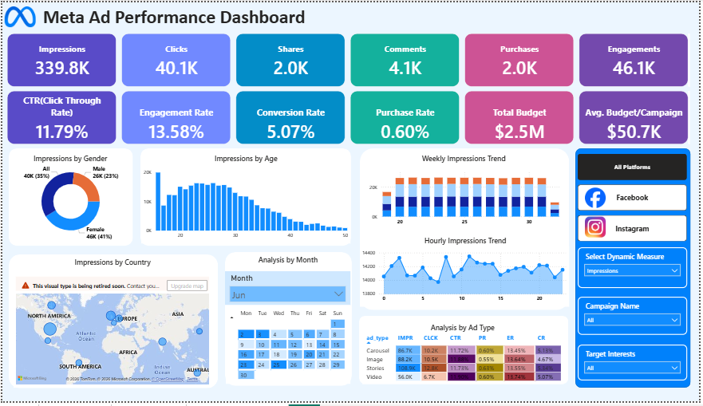

# Meta Ad Performance Analysis Dashboard



## Overview

This project analyzes advertising campaign performance across **Facebook and Instagram** using an interactive **Power BI dashboard**.

The dashboard helps marketing teams track **reach, engagement, conversions, and budget utilization** to evaluate campaign effectiveness and optimize advertising strategies.

---

## Business Objective

The goal of this dashboard is to:

* Compare performance between **Facebook and Instagram campaigns**
* Monitor **engagement and conversion metrics**
* Identify **high-performing audiences and ad formats**
* Support **data-driven marketing decisions**

---

## Tools Used

* Power BI
* Data Modeling
* DAX
* Data Visualization

---

## Key Metrics

The dashboard tracks the following KPIs:

* Impressions
* Clicks
* Shares
* Comments
* Purchases
* Engagements
* CTR (Click-Through Rate)
* Engagement Rate
* Conversion Rate
* Purchase Rate
* Total Budget
* Average Budget per Campaign

---

## Dashboard Visualizations

The report includes the following visualizations:

* **Donut Chart:** Engagement by gender
* **Bar Chart:** Performance by age group
* **Map:** Geographic campaign performance
* **Calendar Heatmap:** Monthly campaign activity
* **Stacked Column Chart:** Weekly performance by ad type
* **Area Chart:** Hourly engagement trends
* **Matrix:** Comparison of ad formats and platforms

---

## Key Insights

* Ads generate strong **engagement and click-through rates**.
* The **18–30 age group** shows the highest engagement.
* **Female audiences** interact more with ads.
* Engagement peaks during **late-night hours**.
* **Stories and Carousel ads** perform best overall.

---

## Project Files

```
meta-ad-performance-analysis/
│
├── data/
│   ├── ad_events.csv
│   ├── ads.csv
│   ├── campaigns.csv
│   └── users.csv
│
├── meta_ad_performance_analysis_db.pbix
├── meta_ad_performance_analysis_brd.docx
├── meta_ad_performance_analysis_db_insights.docx
├── meta_ad_performance_analysis_db_ss.PNG
└── README.md
```
